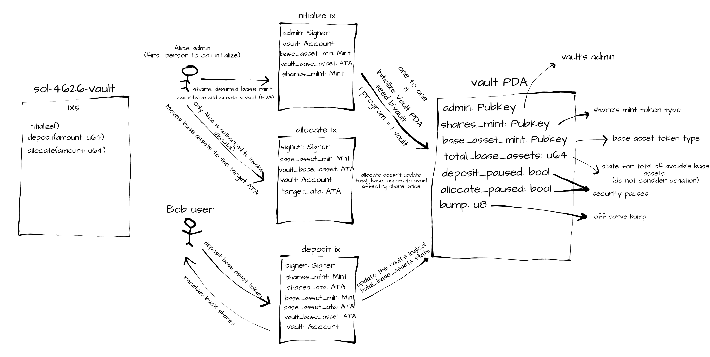

# sol-4626-vault

A minimal ERC-4626-style vault built on Solana using Anchor + SPL Token.
Users deposit a base asset and receive proportional vault shares.
The vault admin can allocate (send) base assets to an external ATA via CPI call, simulating transfer to a yield
strategy.

**Token Program Support:** The program accepts tokens from both `TOKEN_PROGRAM_ID` and `TOKEN_2022_PROGRAM_ID`.

---

### Design

This program allows users to deposit a base asset token into a vault and receive shares representing their stake.
Initialize can be called only once to set up the vault with a specific base asset mint.



**Instructions:**

1. **Initialize Vault**: Sets up the vault with a base asset mint and creates a shares mint with matching decimals.
2. **Deposit**: Users deposit base assets and receive shares based on the vault's total assets and shares.
3. **Allocate**: Vault admin can allocate (transfer) base assets to an external ATA via CPI.

### Math

**Share Calculation (ERC-4626 Standard):**

Implemented in `util/helper.rs:convert_to_shares()`:

```
First deposit (total_shares == 0):
  shares = deposit_amount

Subsequent deposits:
  shares = (deposit_amount * total_shares) / total_assets
```

Forces 1:1 decimal parity between base asset mint and shares mint:

```rust
// initialize.rs:45
mint::decimals = base_asset_mint.decimals
```

- This design enforces a 1:1 decimal ratio between the base asset mint and shares mint:
- All arithmetic uses checked operations or the MulDiv trait
- U128 backing prevents overflow in share calculations even with large amounts

## How to Run

### Prerequisites (Used Versions)

- Solana CLI (3.0.13)
- rustc (rustc 1.89.0)
- Cargo (1.89.0)
- Anchor framework (v0.32.1)
- Node.js(v20.5.1)
- Yarn (v1.22.19)

### Steps

1. **Build**
   ```bash
   # Builds the program and generates all required artifacts (including Keypair and IDL file)
   anchor build

2. **Sync Keys**
   ```bash
   # Sync generated program keypair with the Anchor project (declare_id! + Anchor.toml)
   anchor keys sync
   ```
3. **Install Node dependencies**
   ```bash
   npm install
   ```
   or
   ```bash
   yarn install
   ```
3. **Tests**
   ```bash
   # Starts local validator, deploys, runs tests, shuts down
   anchor test
   ```
   Run tests using running validator (stateful)
   ```bash
   # First, run the validator (reset to clear vault 1:1 state)
   solana-test-validator --reset
   # And then
   anchor test --skip-local-validator
   ```
   rust unit tests
   ```bash
   cargo test
   ```

4. **Deploy to Localnet** (optional)
   ```bash
   # In separate terminal
   solana-test-validator

   # Deploy
   anchor deploy --provider.cluster localnet
   ```
5. **Deploy to Prod** (optional)
   ```bash
   # Deploy
   anchor deploy --provider.cluster mainnet
   ```

6. **Make Program Immutable** (optional)
   ```bash
   # After deploying to mainnet, make the program immutable (no upgrade_authority)
   solana program set-upgrade-authority <PROGRAM_ID> -u <RPC_ENDPOINT> --final
    ```

## Known Limitations

1. No withdraw or redeem instruction implemented yet
2. Vault configuration updates (admin change, pause toggles) not implemented yet
3. Allocation instruction is a simple CPI transfer to an external ATA
4. Only decimals-matching mints/base supported
5. No fuzzy tests or property-based tests yet
6. No CI workflow set up yet

### Known Performance Considerations
1. Zero-copy not used: Avoided to preserve declarative constraints and overall readability, since zero-copy forces manual constraint validation via AccountLoader.
2. No use of ALTs(Address Lookup Tables) on client side yet.

